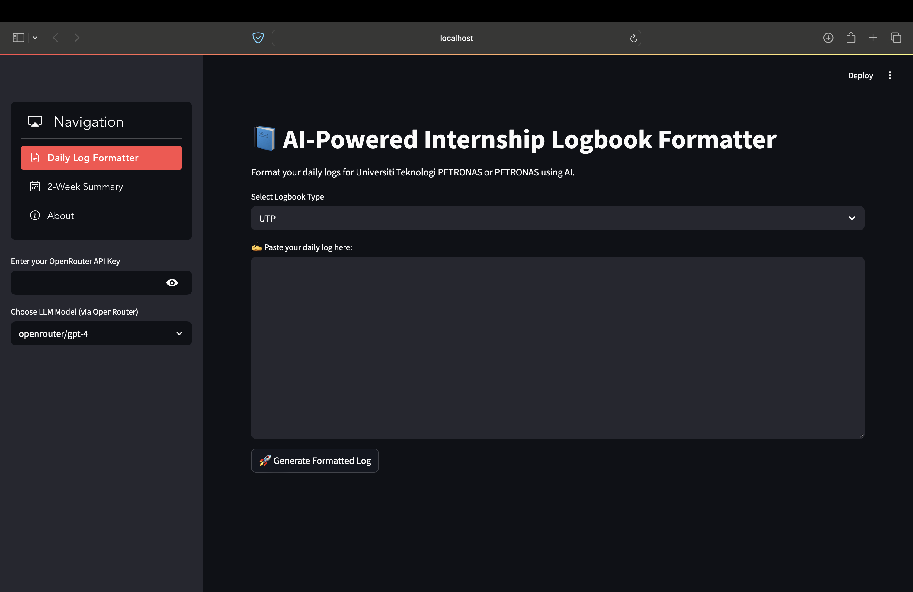

# 📘 AI-Powered Internship Logbook Formatter

A Streamlit web application that helps UTP (Universiti Teknologi PETRONAS) and PETRONAS interns format their daily logs and generate biweekly summaries using AI.


## 🌟 Features

- **Daily Log Formatter**: Format your daily internship activities into structured formats
  - UTP format with Objectives, Details, and Follow-up sections
  - PETRONAS format with clear bullet points
- **2-Week Summary Generator**: Create concise summaries of your biweekly activities for reporting
- **Model Selection**: Choose from various LLM models available on OpenRouter
- **Download Option**: Save your formatted logs as text files

## 📋 Requirements

- Python 3.7+
- Streamlit
- Requests
- streamlit-option-menu
- OpenRouter API key

## 🚀 Installation

1. Clone this repository:
   ```bash
   git clone https://github.com/yourusername/internship-logbook-formatter.git
   cd internship-logbook-formatter
   ```

2. Install the required packages:
   ```bash
   pip install -r requirements.txt
   ```

3. Create a `requirements.txt` file with:
   ```
   streamlit
   requests
   streamlit-option-menu
   ```

## 💻 Usage

1. Run the Streamlit app:
   ```bash
   streamlit run app.py
   ```

2. Open your web browser and navigate to `http://localhost:8501`

3. Enter your OpenRouter API key in the sidebar

4. Choose your preferred LLM model

5. Select either "Daily Log Formatter" or "2-Week Summary" from the navigation menu

6. Enter your log content and click the generate button

## 🔑 API Key Setup

This application uses the [OpenRouter API](https://openrouter.ai/) to access various language models.

1. Sign up for an account at [OpenRouter](https://openrouter.ai/)
2. Generate an API key from your dashboard
3. Enter the API key in the application sidebar

## 📱 Navigation

- **Daily Log Formatter**: Format individual daily logs
- **2-Week Summary**: Generate summaries from two weeks of logs
- **About**: Information about the application

## 🔧 Customization

You can customize the formatting prompts by modifying the `generate_prompt()` and `generate_summary_prompt()` functions in the code.

## 📸 Screenshots



## 🤔 How It Works

1. User enters their daily log content
2. The application creates a structured prompt for the AI
3. The prompt is sent to the selected LLM via OpenRouter API
4. The formatted response is displayed and can be downloaded

## 👨‍💻 Developer

**Made by Khaidhir**, who is currently an intern at **PETRONAS**.

## 📄 License

[MIT](LICENSE)

## 🙏 Acknowledgements

- [Streamlit](https://streamlit.io/) for the web framework
- [OpenRouter](https://openrouter.ai/) for providing access to various LLMs
- [streamlit-option-menu](https://github.com/victoryhb/streamlit-option-menu) for the navigation component